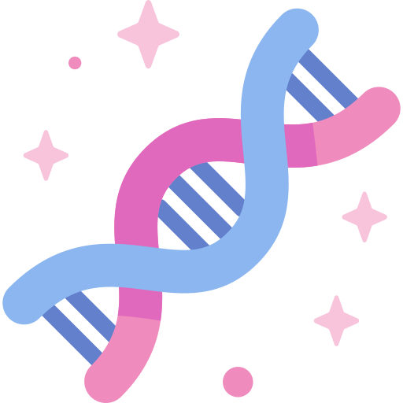

<!-- logo -->

  

<!-- tag line -->
<h1 align='center'>DNA Storage Resource Page</h1>

  
  
  

Welcome to the DNA Resource Page repository! This project is an information gathering website dedicated to providing resources related to research and development in the DNA storage and security field. Users can explore a variety of information, including research papers, articles, books, blogs, companies, courses, patents, research grants, tools, and more.

<h2>Tech Stack</h2>
We have built this project using Next.js 13 as our full-stack framework, leveraging the power of MUI components for a seamless user interface.

<h2>Features</h2>
<ul>
    <li>Table view of information in different categories</li>
    <li>Filtering data using keywords and dates</li>
    <li>User login with Google</li>
    <li>Requesting CRUD access to manage information</li>
    <li>Accepted users can create, update, and delete rows in tables</li>
</ul>

<h2>Installation</h2>
To set up the project on your local machine, follow these steps:
<ul>
    <li>Install Node.js version 20 or above.</li>
    <li>Clone the repository:
    <code>git clone https://github.com/guptalab/DNA-Resource-Page.git</code></li>
    <li>Install dependencies: <code>npm i</code></li>
    <li>Obtain the <code>.env</code> file by reaching out to us at <a target="_blank" href="mailto:dnaresource@guptalab.org">dnaresource@guptalab.org</a></li>
    <li>Create an <code>.env.local</code> file in the cloned project (same directory as README.md) and paste the provided environment variables.
    <li>Run the project: <code>npm run dev</code></li>
    <li>This will start the development server on your machine at port 3000 by default.
    </li>
    <li>Open your favorite browser and go to <a href="http://localhost:3000" target="_blank">http://localhost:3000</a> to view the locally running website.</li>
</ul>
Feel free to explore the code, make changes, and contribute to the project. If you identify areas for improvement, such as code restructuring, refactoring, or logic errors, open a pull request, and our team will review it promptly.

<h2>Project Structure</h2>
The project follows a structured organization to facilitate easy navigation and understanding of the codebase. Here's a brief overview of the main directories:

- **`/public`**: Contains static assets such as images or files used in the project.
- **`/src`**: This is the heart of the application, where the source code resides. Key directories include:
  - **`/components`**: Reusable React components used throughout the application.
  - **`/pages`**: Next.js pages that define the different routes of the application.
  - **`/styles`**: Stylesheets for styling the components and pages.
  - **`/utils`**: Utility functions or helper modules used across the application.

> Additionally, we encourage contributors to write tests for new features or existing functionality.

<h2>Issues/Bugs</h2>
If you encounter any bugs or issues while using our application, please report them in the Issues tab of this repository. Our team will work to address and resolve them promptly.

<h2>Contribution</h2>
We welcome contributions from the community! If you have ideas for new features or improvements, implement them and create a pull request. We appreciate contributions related to UI enhancements. Your efforts will be acknowledged in our contributors' field. Thank you for helping make this project better! 😄

<h2>Deployment</h2>
The application is deployed using <a href="https://vercel.com" target="_blank">vercel.com</a> which uses a continuous integration and continuous deployment (CI/CD) pipeline to automate the deployment process.

<h2>Contact</h2>
If you have any questions, suggestions, or just want to say hello, feel free to reach out to us at <a target="_blank" href="mailto:dnaresource@guptalab.org">dnaresource@guptalab.org</a>. We value community feedback and are eager to hear from you!

 

<i>✨🧬 Happy coding! 🧬✨</i>
